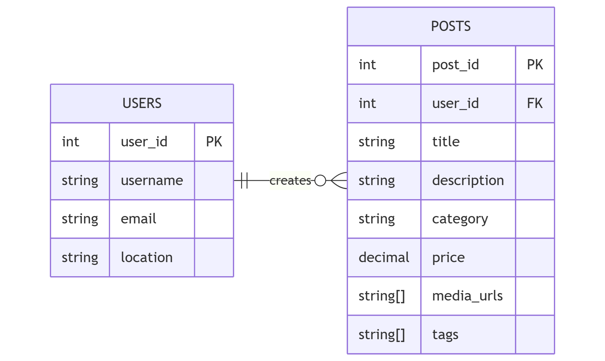
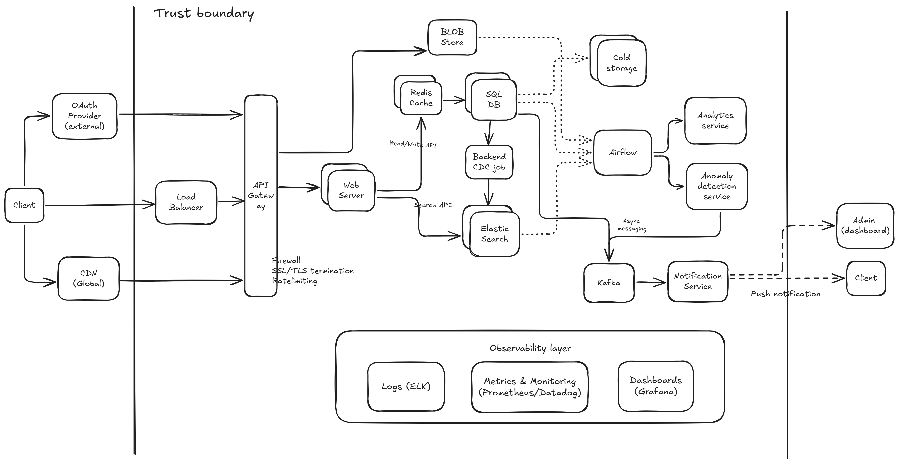

# System Design: Craigslist

## Question

Design a system like Craigslist.

### Similar questions

- Design an online marketplace like eBay.
- Design a social media platform for sharing classified ads.
- Design a platform like OLX.
- Design a job listing platform like Indeed.
- Design a real estate listing platform like Zillow.

### Question Clarifications

Craigslist is a popular online classifieds platform where users create, view, and search for posts across various categories (jobs, housing, services, items for sale, etc.). Users can post listings with images/videos and search/filter by category, location, price, and keywords.

The system designed must handle high traffic volumes while ensuring low latency, high availability, and robust security measures. Key features include post creation, viewing, searching, fraud reporting, and user notifications.

## Requirements

### Estimates

Clarify the ballpark estimates from the interviewer

- **Users**
  - Daily Active Users (DAU): **2M** | Total Users: **10M**
  - User data storage: **10M x 1KB = 10GB**

- **Posts**:
  - Active posts: **~5 million** (searchable, visible; auto-archive after 30 days)
  - Total posts (historical): **500 million** (all posts ever created - stored for analytics/compliance)
  - Metadata storage: **5M x 2KB = 10GB** | archived posts = **500M × 2KB = 1TB**
  - Media storage: **5M x 300KB = 1.5TB** (active) | archived media = **500M x 300KB = 150TB** (use hot/cold storage tiers)

- **Traffic (RPS & Server Requirements)**:
  - Average RPS: **20,000** (based on 2M DAU)
  - Peak RPS: **100,000** (5× average during business hours)
  - Server capacity per instance: **1,000** RPS → **20 servers (avg), 100 servers (peak)**
  - Read:Write ratio = **9:1** | Search queries: **20,000** QPS

- **Database Capacity**:
  - Query Load: **20,000 x 0.9 = 18,000** avg reads | Peak: **90,000** read QPS
  - Write Load: **20,000 x 0.1 = 2,000** avg writes | Peak: **10,000** write QPS
  - **Points to Note**
    - The system is read-heavy due to browsing/searching behavior. But system should account for faster writes during peak posting times.
    - Single DB Instance: ~2,000 QPS capacity (reads + writes combined, e.g., AWS RDS Multi-AZ)
    - **Memory per DB instance**: Vertical scaling limit (~768GB on AWS RDS - much greater than working set size) → determine working set size; if exceeded, requires sharding or partitioning (not needed for this case)
    - **Replication**: 1 primary (handles writes) + 2 read replicas (distribute read load/ failover/ BCDR purposes)

### Functional Requirements

| Requirement                                               | Core Infrastructure              |
| --------------------------------------------------------- | -------------------------------- |
| **UI for User Interaction**                         | Web Server                       |
| **User Management** (create/auth/manage profiles)   | Backend Server + OAuth2 Provider |
| **Post Management** (create/edit/delete/view posts) | Backend Server                   |
| **Search Posts** (keywords, filters)                | Elasticsearch                    |
| **Post Media** (images, videos)                     | Blob Store                       |
| **Report Fraud**                                    | Anomaly Detection Service        |
| **Notifications**                                   | Kafka                            |

### Non-Functional Requirements

| Requirement                           | Core Infrastructure         |
| ------------------------------------- | --------------------------- |
| **Scale: 10M Users**            | Single DB for user data and post metadata |
| **Availability: 99.9%**         | Multi-region Replication (failover region takes over in case of primary region failure)|
|                                 | active-active or active-passive setup (active-passive recommended - cost-effective and low complexity)   |
| **High Performance**            | Redis Cache & CDN (reduce DB load and latency)          |
| **Security**                    | API Gateway + TLS (used as a Firewall, rate limiting, SSL termination) |
|                                 | Encryption at rest and in transit, HTTPS/REST based communication |
| **Search Performance**          | Elasticsearch (because full text search or filters slow down SQL DB reads) |
| **Observability**               | Prometheus + ELK |
| **Analytics**                   | Batch ETL + Airflow (background process - no user flow/involvement) |
| **Latency** (not strict)        | Message Queues (Kafka) for async+batch processing of create Post requests |
| **Consistency** (not real-time) | Eventually consistent posts |

---

### Data Storage & Schema

#### Schema Relationships

By using a relational database, we can efficiently manage user-post relationships, enforce data integrity, and perform complex queries (joins) for searching and filtering posts.
So, RDBMS is chosen over NoSQL DBs for this use case.

Entity Relationship Diagram (ERD) for SQL DB:


#### Storage Details

| Storage                 | Key Data     | Schema Highlights                                                                                                |
| ----------------------- | ------------ | ---------------------------------------------------------------------------------------------------------------- |
| **SQL DB**        | Users        | user_id (PK), username, email, phone, password_hash, location, account_status, created_at                        |
|                   | Posts        | post_id (PK), user_id (FK), title, description, category, location, price, status, media_urls (JSON), expires_at |
| **Blob Store**    | Media        | `/posts/{post_id}/{file_id}` - Images (JPG/PNG, 10MB), Videos (MP4, 500MB)                                     |
| **Elasticsearch** | Search Index | post_id, title (text), description (text), category (keyword), location (geo), price, created_at, view_count     |
| **Redis**         | Cache        | post:{id} (1h TTL), user:{id}:posts (30m), trending:{category} (15m), session:{id} (24h)                         |

Indexing for faster queries:

- Users: index on username, email (for fast lookups during login/registration)
- Posts: indexes on title, category, location, created_at (for efficient searching/filtering)
- Elastic Search creates full-text indexes on all searchable fields (title, description, category, location)

---

## High level Architecture Diagram

### Infrastructure Sizing & Configuration



### Responsibilities of different services

- **User Service**: user management, authentication
- **Post Service**: CRUD operations for posts
- **Search Service**: interfacing with Elasticsearch
- **Notification Service**: handling notifications
- **Fraud Detection Service**: monitoring and reporting fraudulent activity
  - Spam prevention: detect and remove spam listings
  - Trust/reputation: user ratings and review history (future scope)

| Infrastructure                  | Purpose                                          | Sizing/Configuration                                     |
| ------------------------------- | ------------------------------------------------ | -------------------------------------------------------- |
| **SQL Database (PostgreSQL/MySQL)** | Primary data storage for users & active posts | 1 primary + 2 read replicas; User data: 10GB, Active posts metadata: 10GB; QPS capacity: ~2,000 (reads + writes combined) |
| **Cold Storage (S3 Glacier/Archive)** | Long-term archival of historical posts & media | Archived post metadata: 1TB; Archived media: 150TB; Retrieval time: Hours (not needed for hot queries); Cost: ~$4-8/TB/month |
| **Redis Cache**                 | Fast data access for hot data                    | Hot post metadata (80:20 Pareto Principal on active posts = 1M posts × 2KB = 2GB); user sessions (2M DAU × 1KB = 2GB); aggregate stats (category/location counts, leaderboards = ~10MB); **total: ~4GB** |
| **CDN (CloudFront/Akamai)**     | Media caching                                    | 0.9TB active media cached globally; cache TTL: 30-90 days for posts, 1 year for immutable assets |
| **API Gateway + TLS**           | Request routing, security & rate limiting        | 20-100 servers (autoscale), rate limit: 1,000 RPS/server (rate limit using token bucket algorithm) |
| **Elasticsearch**               | Full-text search & filtering                     | 5+ nodes, 3 replicas, shards per index                   |
| **Prometheus + ELK**            | Monitoring & centralized logging                 | Central aggregation, 7-day retention                     |
| **Batch ETL + Airflow**         | Data pipeline & analytics processing             | Daily jobs, 25TB+ media storage                          |
| **Message Queues (Kafka)**      | Asynchronous event processing                    | Accept 200-500ms write latency for durability            |
| **Eventually Consistent Posts** | Eventual consistency for post data                | Batch processing                                         |

Future additions:

- **Recommendations engine**
  - personalized recommendations based on user behavior and preferences
  - ML + collaborative filtering
- **Payment integration**
  - paid listings, premium features
  - integrate with payment gateways (Stripe/PayPal)

---

## Data Flow

**Write (Create Post)**

```
User → API Gateway → Backend → DB + Blob Store → Kafka (async)
```

**Read (View Posts)**

```
User → API Gateway → Backend → Redis/DB → Elasticsearch (if search) → Response
```

**Search**

```
User → API Gateway → Backend → Elasticsearch → Response
```

**Notifications**

```
Post Created → Kafka → Notification Service → Push/Email/SMS → User Device (Info notification)
Fraud Detected → Kafka → Notification Service → Alert → User Device (Warning notification)
```

---

## Additional Discussion Points

- Data retention & auto-deletion policies
  - Posts automatically expire after 30 or 60 days
  - A cleanup service handles deletion
- Rate limiting & throttling
  - API Gateway enforces per-user/IP limits (e.g., 1,000 RPS)
  - Prevent abuse and ensure fair usage
- How is S2S communication handled?
  - REST for internal service-to-service calls gRPC (for making it more efficient)
  - For async tasks, use Kafka
- Graceful degradation (fallbacks when services down)
  - Fallback to cached data or degraded functionality
  - Circuit breaker pattern to prevent cascading failures
- Static HTML - alternative storage for posts
  - Pre-rendered HTML for faster loads, no need of data hydration in HTML
  - Can be served from a CDN
- Separate elastic clusters for logging and search:
  - separation of concerns + single responsibility
  - avoiding single points of failure which impacts both search and logging (search won't work and we wouldn't know)
- GDPR/CCPA compliance
  - user data management, right to be forgotten
  - separate storage for PII and separate storage in separate geo locations for regional compliance
  - encryption of sensitive data at rest and in transit
